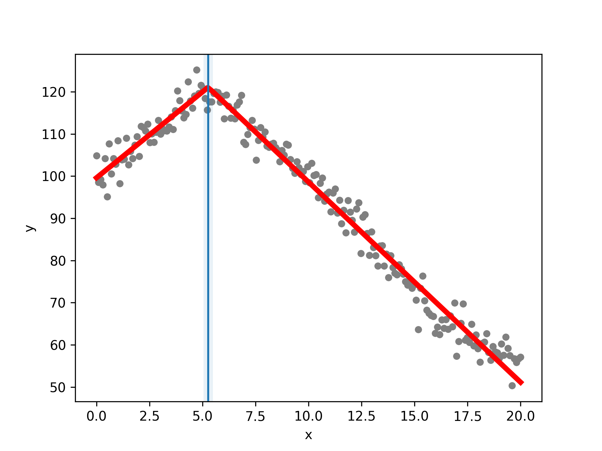

# Summary

Piecewise regression (also known as segmented regression, broken-line regression or breakpoint analysis) allows for the fitting of continuous straight lines to data where there is one or more breakpoint where the gradient changes. The approach here is that described by Muggeo[muggeo2003estimating] whereby the breakpoint positions and the straight line models are simultaneously fit using an iterative method. The package includes comprehensive statistical analysis that gives confidence intervals for all model variables, and hypothesis testing for the existence of breakpoints. 

# Statement of need

A common problem in research is to investigate when some trend changes, modelled as a straight line relationship with a change in gradient at some point. One approach would be numerical minimisation of the sum of squared errors via a grid search for the breakpoint position(s). Muggeo[muggeo2003estimating] derived a method that is superior to grid search in that it is computationally more efficient and allows for more robust statistical analysis. There are many R packages that implement this method including the segemented R package written by Muggeo himself[muggeo2008segmented]. However, at the time of writing there are not comparable resources in python. 

# Examples

An example fit is shown in Figure \autoref{fig:example}. 

# Mathematics

It is not necessary to know the underlying mathematics to use the package. We follow here the derivation by Muggeo[muggeo2003estimating]. The general form of the model with one breakpoint is

\begin{equation}
    y = \alpha x + c + \beta (x-\psi) H(x-\psi) \,,
\end{equation}

where we are trying to fit the gradient of the first segment, $\alpha$, the intercept of the first segment, $c$, the change in gradient from the first to second segments, $\beta$, and the breakpoint position, $\psi$. $H$ is the Heaviside step function. This cannot be solved directly through linear regression as the relationship is non-linear. We can take a linear approximation by a Taylor expansion around some initial guess for the break-point, $\psi^{(0)}$, 

\begin{equation}
    y \approx \alpha x + c + \beta (x - \psi^{(0)}) H (x - \psi^{(0)}) - \beta (\psi - \psi^{(0)}) H(x - \psi^{(0)}) \,.
\end{equation}

This is a linear relationship and we can find a new breakpoint estimate, $\psi^{(1)}$, through linear regression. We iterate in this way until the breakpoint estimate converges, at which point we stop the algorithm. The same method can be used with multiple breakpoints, taking a multivarite Taylor expansion around initial guesses for the breakpoints. 

# Acknowledgements

I acknowledge support from Thomas Hills. The work was funded by the EPSRC grant for the Mathematics for Real-World Systems CDT at Warwick (grant number EP/L015374/1)

# References